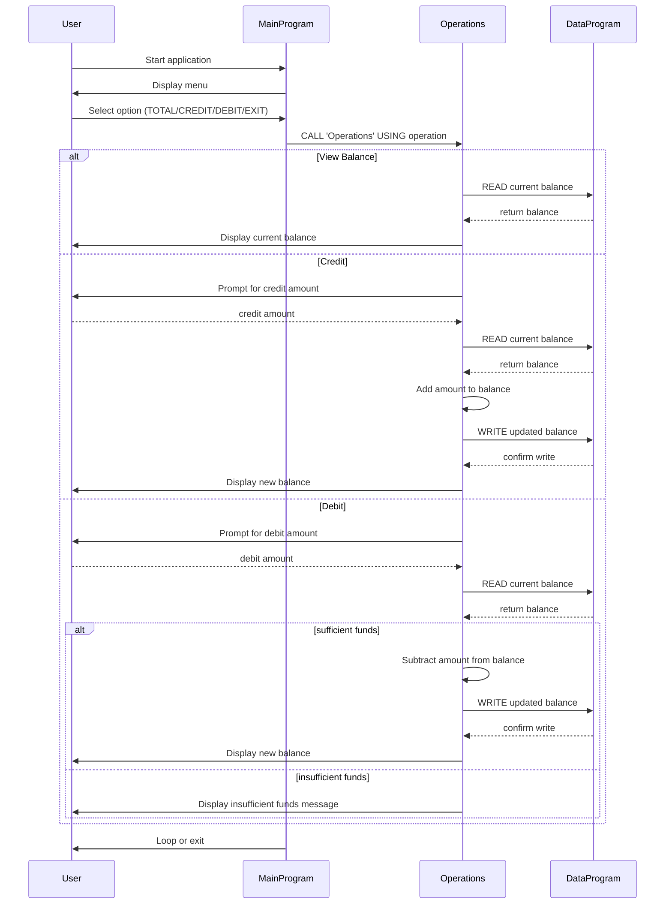

# COBOL Student Account Management

This `docs/README.md` describes the purpose of each COBOL source file in `src/cobol`, the key functions they provide, and the student account business rules implemented in the legacy system.

## Project Overview

The legacy COBOL programs implement a simple student account management system for viewing, crediting, and debiting a student account balance. The system uses three programs:

- `main.cob` - user interface and menu logic
- `operations.cob` - account operation dispatcher and validation
- `data.cob` - in-memory data storage for account balance

## File Descriptions

### `src/cobol/main.cob`

Purpose:
- Acts as the main entry point for the application.
- Displays the account management menu.
- Accepts user menu choices and dispatches operations.

Key behavior:
- Presents options: View Balance, Credit Account, Debit Account, Exit.
- Sends the selected operation to `Operations` using `CALL 'Operations' USING ...`.
- Continues prompting until the user chooses option `4` to exit.

### `src/cobol/operations.cob`

Purpose:
- Implements the account operation logic for balance inquiry, credit, and debit.
- Handles user prompts for credit and debit amounts.
- Validates debit transactions against available balance.

Key functions:
- `TOTAL` operation: reads and displays the current balance.
- `CREDIT` operation: reads the current balance, adds the entered amount, writes the updated balance.
- `DEBIT` operation: reads the current balance, checks whether sufficient funds exist, subtracts the entered amount, and writes the updated balance if valid.

### `src/cobol/data.cob`

Purpose:
- Provides in-memory account balance persistence within the running program.
- Responds to read and write requests from `Operations`.

Key functions:
- `READ` operation: moves the stored in-memory `STORAGE-BALANCE` into the passed `BALANCE` field.
- `WRITE` operation: updates `STORAGE-BALANCE` with the new balance value passed from `Operations`.

## Business Rules for Student Accounts

- The default account balance is initialized to `1000.00`.
- Balance inquiries simply display the current balance without modifying data.
- Credit transactions are always allowed and increase the balance by the entered amount.
- Debit transactions are only allowed when the requested debit amount is less than or equal to the available balance.
- If a debit amount exceeds the available balance, the transaction is rejected and `Insufficient funds for this debit.` is displayed.
- No persistence beyond the program run is implemented; the balance is stored in working-storage only.

## Notes

- The program uses fixed-length operation codes (`TOTAL `, `CREDIT`, `DEBIT `) when calling the `Operations` program.
- All amounts are handled as numeric fields with two decimal places (`PIC 9(6)V99`).
- The current design is suitable for demonstration and modernization exercises, not for production account storage.

## Sequence Diagram

